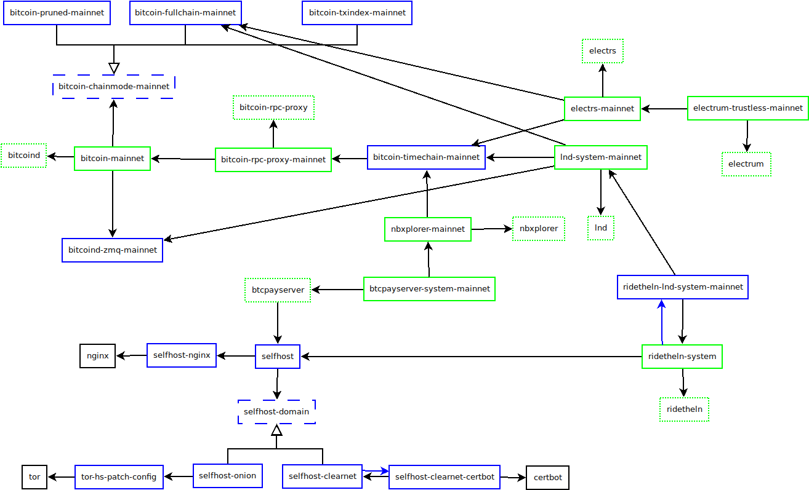
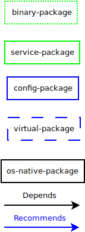

# Administrator documentation of Cryptoanarchy Debian Repository

This document describes details relevant for advanced configuration and administration of this repository. It is expected that you read user-level documentation first, you'll be lost otherwise.

## Pillars of the project

This project stands on three key principles:

* Automation - apart from obvious upside of decreasing the time needed for performing certain tasks, the often forgotten effect of automation is increased reliability.
* Security by isolation - while this project does not use as strong isolation mechanisms as Qubes OS, it aims to follow similar principles. Each service has its own user with minimal permissions.
* Composability and loose coupling - instead of having bunch of scripts hacked together, this system uses Debian packaging in order to be open to adding new features easily. While not perfect at this point, it already avoids installing what the user doesn't want. This also increases security by decreasing attack surface. Reliability is provided by strongly defined interfaces (to be improved in the future).

### Automation

Automation of this project has three layers:

* Automation of building - irrelevant for admin-level documentation, see repository-developer documentation
* Automation of dependency management - delegated fully to `apt`/`dpkg`
* Automation of configuration - inputs delegated to `debconf`, the relationships between packages are handled by postinst scripts (to be improved)

This means you should not have to mess with the management too much. However, there are legitimate cases in which you need to tune some parameters. This documentation aims to explain how to do it.

In order to make the system as robust as possible, this repository aims to use standard Debian practices as much as possible. That means putting the configuration primarily into `debconf`, use of alternatives system etc. Whenever you need to change some parameter (most notably datadir of bitcoind), you need to look if it's settable via `debconf`. You can do this by running the installation with `DEBIAN_PRIORITY=low` or `DEBIAN_PRIORITY=medium` environment variables (WARNING: don't forget that `sudo` deletes the environment, put those vars **after** `sudo`) If you already installed some packages, you will need to run `dpkg-reconfigure PACKAGE`. Note however, that there's no migration system developed *yet*, so you will need to do extra work for changing some settings! See #70.

The most important non-trivial case is changing path settings. The proper way to do it currently is:

1. Stop the service using `systemctl`. E.g. `systemctl stop bitcoin-mainnet`
2. Move the relevant files. E.g. `mv /var/lib/bitcoin-mainnet /big-hdd/bitcoin-mainnet`
3. Run `dpkg-reconfigure` and change the specific setting E.g. `dpkg-reconfigure bitcoin-mainnet`
4. The service should auto-start again. You can check it by running `systemctl status`.

If you didn't find the setting in debconf, you must look if it can be set by installing a special package. This is not done often, only in cases a package might need another package to have certain feature. The list of packages that control specific settings:

* `bitcoin-pruned-mainnet` - sets `prune=$prune_size`, `txindex=0`, `$prune_size` is 550 by default
* `bitcoin-fullchain-mainnet` - sets `prune=0`, `txindex=0`
* `bitcoin-txindex-mainnet` - sets `prune=0`, `txindex=1`
* `bitcoin-zmq-mainnet` - activates ZMQ
* `bitcoin-timechain-mainnet` - adds user `public:public` to `bitcoin-rpc-procy` which allows querying public timechain information.
* `selfhost-clearnet` - configures `selfhost` to use specific clearnet domain, turns off Tor hidden service by default, but you can still turn it on by installing `selfhost-onion` too

Another special case are "bridging packages" that connect two loosely coupled packages together. This makes it possible to install one without the other and gain special features when installing both.
They may allow, or even require some additional configuration. Current list of such bridging packages:

* `ridetheln-lnd-system-mainnet` - plugs `lnd-system-mainnet` into `ridetheln-system`
* `selfhost-onion` - provides onion domain to `selfhost` using Tor.
* `selfhost-clearnet-certbot` - provides TLS certificate to `selfhost-clearnet` using `certbot`.
* `selfhost-nginx` - provides reverse proxy to `selfhost` using `nginx`. This one is currently hard-wired and must always be used with `selfhost`. It shouldn't be too hard to decouple later.

If the option you desire to change is not present, please file an issue at this repository to add it to debconf first! I'll do my best to add it ASAP. If you can't afford to wait, add it into a new file in the respective `conf.d` directory. E.g. if a new configuration option `foo` is added to `bitcoind` and it's not in debconf yet, you'd create `/etc/bitcoin-mainnet/conf.d/my-config.conf` containing line `foo=your_value`.

**Important: Under no circumstances edit the generated config files!** The generated config files may be overwritten during any apt operation.

### Security by isolation

The project follows some important rules that will become even more strict once the required tooling for handling that strictness is developed. So far these apply:

* Each service has its own user, except for `bitcoin-rpc-proxy-mainnet`, which shares it with `bitcoin-mainnet` as separating them wouldn't increase security.
* Each user has minimal privileges required for it to function
* Bitcoin RPC proxy is used for every service which needs the access to public timechain data only
* Cookie files are used for each service that supports them
* The configuration files and data directories are protected by default
* Unix permissions and groups are used to control the access to various services

### Composability

The various services are separated into their own packages, with clearly defined interfaces. This has several advantages:

* Faster response to vulnerabilities. If a vulnerability is found in one of the packages, we only need to update that package.
* Reduced attack surface by not installing the parts user doesn't need.
* Reduced load on server infrastructure. Each user downloads only what they need.
* Easier to develop new features. When a new feature is developed, it doesn't require changing many things withing the system. It usually means just adding a new package to the list.
* Ability to provide alternative packages. This property is not fully developed yet, but at the end, it should be easy to swap Lightning implementations, Electrum servers, databases...

This is achieved by carefully defining dependencies between packages. A lot of build-level automation ensures that important dependency relationships are not missed or misdeclared.

Here's the dependency graph of the packages at the time of writing the documentation:

The meaning of various colors and line styles:

Note that all binaries recommend their respective services. The arrows aren't shown to make the image less messy.

As you can see there are various types of packages:

* Binary packages - provide the code needed to execute specific service without doing anything themselves. These are accompanied by service packages. The main idea is that once testnet versions are created, they can share the same binaries.
* Service packages - handle the management of the service (via systemd) as well as its configuration. They are recommended by their binary packages in order to work out-of-the-box.
* Configuration packages - make sure that if another package needs a service with certain feture configured, this feature gets turned on.
* Virtual packages - implement abstraction between various implementations of the same feature.
* OS native packages shown in the graph obviously aren't included in this repository, but they are displayed in the graph to explain the relationships better.

## Features specific to this project

Aside from configuration, there are various other differences when compared to manual deployment of Bitcoin software or other similarly looking projects:

* More Unix-y architecture. The services are handled by the init system (systemd), not custom scripts, access is controlled using permissions, users and groups...
* This project conforms to Linux File System Hierarchy Standard. The system-level configuration is stored in `/etc/service-name`, service state files are stored in `/var/lib/service-name`, architecture-independent files in `/usr/share/package-name`, architecture-specific file in `/usr/lib` and `/usr/bin`...
* Whenever possible, the configuration is read from directories instead of files. If not directly supported, it's worked around by postinst concatenating those files together. This is (automatically) hooked to dpkg triggers, so that the configuration is re-generated when other relevant packages are modified.
* Tools are pre-configured to work with services installed on the machine. Electrum wallet connects to `electrs` only by default, out-of-the-box. `lncli` connects to system `lnd` by default, out-of-the-box...
* There's a special system called `selfhost` for managing web applications and domains. It makes sure your server is securely accessible over network connection.
* `ridetheln` (AKA RTL; Ride The Lightning) has ID allocator which manages assigning identifiers to the connected nodes.
* `btcpayserver` connects to the database using standard Debian tool called `dbconfig`. It creates the user and database automatically.
* `btcpayserver` purposefuly does **not** use `docker`. This gives us all the advantages packaging has over `docker` and as a side effect avoids shitcoins.
* `ridetheln` forces SSO. The `access_key` is stored in `/var/lib/ridetheln-system/sso/cookie`. There are plans to make it easier to open in the future.
* `lnd` (transitively) recommends `lnd-unlocker-system-mainnet`, which initializes the wallet and unlocks it after each (re)start of lnd. The seed is stored in `/var/lib/lnd-system-mainnet/.seed.txt`

### Accessing lnd

In order to conveniently access `lnd`, `lncli` is wrapped in a script called `xlncli`. This is set as the default using great Alternatives system. If you dislike `xlncli` for any reason, you can easily configure `lncli` command to use real `lncli`. However, this should not be needed since `xlncli` passes all arguments to `lncli` as needed. It only inserts additional arguments telling `lncli` to connect to the local `lnd` if it doesn't detect that you're attempting to connect to some other daemon. In other words, running something like `lncli getinfo` will connect to your own server (if you have permissions - read below), while `lncli --rpcserver somethingelse --macaroonpath somethingelse/admin.macaroon --tlscertpath somethingelse/tls.cert getinfo` will connect to a server `somethingelse` using given credentials.

In order for this to work, the user running `lncli` must have the permission to read macaroons. The easiest way to do that is run it with `sudo`, which causes `xlncli` to automatically identify admin permissions and use `admin.macaroon`. Giving anothe user (including yourself) the access to admin macaroon is as simple as running `sudo usermod -a -G lnd-system-mainnet username`. For invoice macaroon, use  `sudo usermod -a -G lnd-system-mainnet-invoice username`, finally `sudo usermod -a -G lnd-system-mainnet-readonly username` will give `username` read-only access to LND.

### Accessing BTCPayServer

There are two ways to access BTCPayServer: over Tor hidden service (`.onion` domain) and over "clearnet" - using regular domain. The former is much easier and more secure for general users, but more difficult to access for their customers. `onion` is picked by default since it doesn't require any additional input. If you wish to use clearnet domain, you must install `selfhost-clearnet` package, which will ask you about the domain name during config phase using `debconf`. Unless you use `--no-install-recommends`, it will also install `selfhost-clearnet-certbot`, which asks for an e-mail address and creates a TLS certificate for you using Letsencrypt. If you use clearnet domain during initial installation, onion is skipped by default. You must specify it explicitly if you want both.

Once you have the appropriate packages installed, go to `http(s)://domain/btcpay` (unless you adjusted the path during debconf phase). You can get the onion domain by running `sudo cat /var/lib/tor/selfhost_hidden_service/hostname`. BTCPayServer will ask you to register an admin account. Thus, it's recommended to visit the domain and register the account ASAP. You can then continue using BTCPayServer as you normally would. You might find some features missing, that are pressent in the docker version. These features are being worked on (except for shitcoins; not that I'd hate them too much, I just don't have time for them, when there are more important things to address). You can affect the priority by letting me know which features do you need the most.

### Accessing RTL (Ride The Lightning)

Accessing RTL is pretty much the same as accessing BTCPayServer. Same rules about `selfhost-*` packages. Go read that docs first. The most important differences are:

* It's impossible to change the web path to something else than `/rtl`. It's because it's hard-coded and can't be "un-hard-coded" because of some limitation of JavaScript/NodeJs/NPM or whatever crap, if I understand it correctly. Sorry.
* RTL uses SSO, which currently isn't wired to some nice web interface. You need to get the `access_key` from `/var/lib/ridetheln-system/sso/cookie` and append the key to the URL, like this: `https://example.com/rtl?access_key=THE_KEY_HERE`. It will do the proper redirects to sign you in.

### Accessing other, unexposed services

This section applies to bitcoind RPC, electrs RPC, LND RPC.

All services bind to `127.0.0.1` by default. There's currently little desire to allow changing it, as it'd open a can of worms around security implications. If you need to access it remotely, consider using one of these options:

* SSH tunnel - this may be the best option. SSH tunnel is a way to securely forward traffic from your computer or an Android/Purism phone (sorry ~~jailOS~~ iOS) with built-in authentication and encryption. You can set it up by adding a new users (for security purposes) and allowing it to tunnel those ports based on SSH key. Then you can use autossh on the computer or ConnectBot on Android with the appropriate key to bring the port to the client. Finally set the client to use `127.0.0.1:PORT`.
* Tor hidden service - about as secure as SSH, just slower. The biggest upside is no need for public IP address and port forwarding. The recommended way is to install `tor-hs-patch-config` and then adding a configuration file to `/etc/tor/hidden-services.d` This will create yet another onion domain, distinct from the web access. That address should stay secret to improve security, so reusing the web domain is now unsupported.
* TLS tunnel - this may be tricky to install, you will need to carefully edit nginx configuration files and get a certificate. This may become better supported in the future. Let me know if you need it. LND uses its own certificate, but there are good reasons to still not rely on it! SSH tunnel and separate, secret onion addresses are better.

There are already plans to add native, automated support for these tunnels. Stay tuned, or better yet, help with the implementation!
